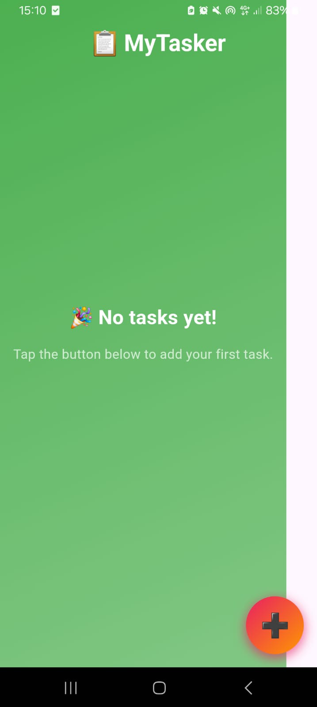
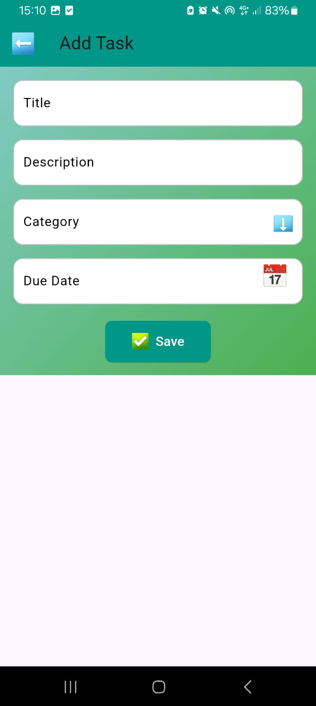

# MyTasker

**Developer**: Youssef Aidi  
**Matricola**: 338891  
**Project**: Task Manager App  

## Project Title
**MyTasker** - A sleek and efficient task management mobile application.

## Project Overview
MyTasker is a Flutter-based task management application designed to help users organize their tasks efficiently. It offers features like task categorization, due date tracking, and a user-friendly interface. The app's modern design includes emoji-based elements to enhance user interaction and visual appeal.

### Key Features:
1. Add, edit, and delete tasks.
2. Categorize tasks with predefined options like Work 💼, Personal 🎯, and Fitness 🏋️.
3. Set due dates using a calendar picker.
4. Persistent task storage using the `sqflite` package.
5. Custom animations for task completion.

## User Experience Overview
### Common User Actions:
- **Adding a Task:** 
  1. Tap the ➕ button on the home screen.
  2. Fill in the task details, select a category, and set a due date.
  3. Press ✅ Save to add the task.

- **Editing a Task:**
  1. Tap on an existing task from the list.
  2. Modify the details and save changes.

- **Marking a Task as Completed:**
  1. Use the checkbox next to a task to mark it as completed.
  2. The task title will be visually updated with a strikethrough effect.

## Screenshots

### 1. Home Screen

### 2. Add Task Screen

## Technologies Used
1. **Flutter**: For cross-platform app development.
2. **State Management**: `provider` package for managing app state.
3. **Local Storage**: `sqflite` for task persistence.
4. **UI Enhancements**: Emoji icons, gradient backgrounds, and custom UI elements.

### Noteworthy Implementation Choices:
- **Custom Animations**: Added animations for marking tasks as completed.
- **Emoji Integration**: Replaced conventional icons with emojis for a modern touch.
- **Responsive Design**: Supports both portrait and landscape orientations.

## Challenges and Solutions
- **Challenge**: Integrating smooth animations for task completion.  
  **Solution**: Used Flutter's animation libraries to add subtle effects.
- **Challenge**: Ensuring consistent emoji rendering across platforms.  
  **Solution**: Carefully selected emojis supported on Android.

## How to Run the Project
1. Clone the repository or download the ZIP file.
2. Open the project in Android Studio or VS Code.
3. Run `flutter pub get` to install dependencies.
4. Use the command `flutter run` to launch the app on an emulator or connected device.

"# MyTasker" 
